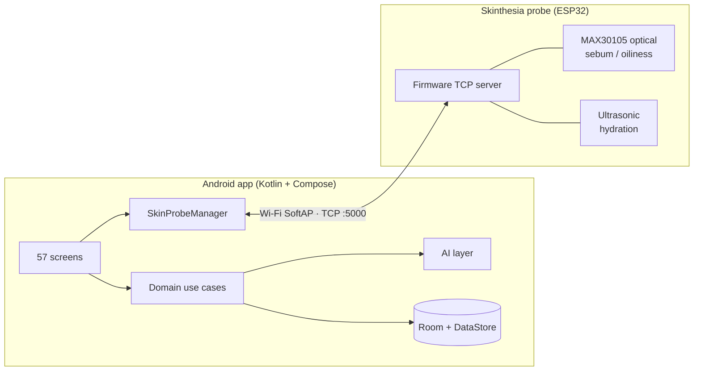

<p align="center">
  
</p>

<p align="center">
  <strong>Connected skin-health platform: a guided Android app and a handheld multi-sensor probe.</strong>
</p>

<p align="center">
  <a href="https://github.com/mohammedsalikps/skinthesia_final_mvp/actions/workflows/ci.yml"></a>
  
  
  
  
  
  
</p>

---

## Overview

Skinthesia pairs a camera-based skin assessment with physical measurements
from a handheld probe. The result is a personal **SkinPrint**: a five-dimension
skin profile that drives a daily routine, tracks progress through weekly
check-ins, and shows a realistic 12-week potential range.

This repository contains the complete MVP:

| Component | Path | Language |
|-----------|------|----------|
| Android application | [`app/`](app) | Kotlin, Jetpack Compose |
| ESP32 probe firmware | [`firmware/esp32-probe/`](firmware/esp32-probe) | C++ (Arduino) |
| Probe bench diagnostics | [`tools/probe-cli/`](tools/probe-cli) | Python |
| Technical documentation | [`docs/`](docs) | Markdown |

## Key features

**Assessment**
- Guided onboarding: profile, goals, skin questionnaire and lifestyle factors
- Guided selfie capture (CameraX) with on-device photo-quality scoring and retake guidance
- Probe pairing, calibration and three-region measurement (forehead, left cheek, right cheek)
- Combined camera and sensor analysis producing the SkinPrint:
  clarity, even tone, texture, hydration and pore appearance

**Insight**
- Interactive SkinPrint score ring and radar visualisations
- 12-week potential range with a week-by-week visual projection of the user's own photo
- Detailed skin report and area-by-area breakdown

**Programme**
- Personalised AM/PM routine with product recommendations
- Weekly check-ins, before/after progress comparison and an adaptive plan
- Journey timeline with milestones

**Ecosystem**
- Marketplace with categories, cart, checkout and order history
- Expert consultation booking
- Learning library and a text-first community
- Privacy controls, with all data stored on the device

## System architecture



The app follows a layered architecture (feature, domain, data, AI and hardware)
with a single hand-written dependency graph in
[`AppContainer.kt`](app/src/main/java/com/skinthesia/AppContainer.kt). Every AI
and hardware component sits behind an interface, so moving from development
implementations to production services is a one-line change per component.
Full details are in [docs/ARCHITECTURE.md](docs/ARCHITECTURE.md).

## Repository structure

```
skinthesia/
├── app/                          Android application
│   ├── src/main/java/com/skinthesia/
│   │   ├── feature/              Screens and ViewModels, one package per product area
│   │   ├── core/                 Design system, shared UI, navigation, launch intro
│   │   ├── domain/               Models, repository interfaces, use cases
│   │   ├── data/                 Room database, DataStore, seed content
│   │   ├── ai/                   Vision, analysis, SkinPrint, recommendations, projection
│   │   ├── hardware/             Probe state machine, ESP32 Wi-Fi transport, simulator
│   │   └── camera/               CameraX capture
│   ├── src/test/                 JVM unit tests
│   ├── src/androidTest/          Compose UI tests
│   └── schemas/                  Exported Room schema
├── firmware/esp32-probe/         Probe firmware (Arduino sketch)
├── tools/probe-cli/              Bench diagnostics and probe emulator
└── docs/                         Architecture and protocol documentation
```

## Technology

| Area          | Stack |
|---------------|-------|
| Language      | Kotlin 2.2 (JVM 17) |
| UI            | Jetpack Compose, Material 3, custom design system |
| Navigation    | Navigation Compose with type-safe `@Serializable` routes |
| Async         | Kotlin Coroutines and Flow |
| Persistence   | Room (KSP), DataStore, kotlinx.serialization |
| Camera        | CameraX |
| Build         | Gradle (Kotlin DSL), version catalog, AGP 8.13 |
| Firmware      | ESP32, Arduino core, SparkFun MAX3010x library |
| Tooling       | Python 3 (standard library only) |

## Getting started

### Android app

Requirements: a current Android Studio release (bundles JDK 17+) and Android SDK 36.

```bash
git clone https://github.com/mohammedsalikps/skinthesia_final_mvp.git
cd skinthesia_final_mvp
./gradlew assembleDebug
```

The debug APK is written to `app/build/outputs/apk/debug/`. Install it on a
device or emulator running Android 8.0 or newer, or open the project in Android
Studio and press **Run**.

Release build:

```bash
./gradlew assembleRelease
```

This produces a minified, resource-shrunk `app-release-unsigned.apk`. Signing
credentials are intentionally kept out of the repository. Sign the release with
your own keystore using Android Studio (*Build > Generate Signed App Bundle / APK*)
or `apksigner`.

### Probe firmware

See [firmware/esp32-probe/README.md](firmware/esp32-probe/README.md) for wiring,
library setup and flashing instructions.

### Connecting the app to a physical probe

The app ships with the built-in probe simulator enabled so every flow can be
demonstrated without hardware. To use a physical probe:

1. Set `USE_REAL_ESP32_PROBE = true` in
   [`AppContainer.kt`](app/src/main/java/com/skinthesia/AppContainer.kt) and rebuild.
2. Power on the probe and join its `Detector_Device` Wi-Fi network from the phone.
3. Open the app and go to **Connect probe**. If the probe cannot be reached,
   choose **Simulate** to continue the same flow on the simulator.

### Bench diagnostics

```bash
python tools/probe-cli/probe_cli.py read --sebum
```

Reads every sensor from a laptop joined to the probe's network. See
[tools/probe-cli/README.md](tools/probe-cli/README.md).

## Testing

```bash
./gradlew testDebugUnitTest          # 57 JVM unit tests
./gradlew connectedDebugAndroidTest  # 3 Compose UI tests (device or emulator required)
./gradlew lintDebug                  # static analysis
```

## Implementation status

This is an MVP. Interfaces are production-shaped; some implementations are
deliberately development stand-ins, and the app labels them clearly to users.

| Area | Status |
|------|--------|
| App flows (57 screens) | Complete |
| Photo-quality scoring | On-device implementation |
| Skin vision analysis, analysis engine, recommendations | Rule-based development engines behind production interfaces, ready for trained models |
| Probe transport (Wi-Fi TCP) | Implemented to the firmware protocol; field validation with production hardware in progress |
| Probe: sebum (optical) | Live on device; app integration of the category result pending |
| Probe: hydration (ultrasonic) | Live; calibrated hydration index pending |
| Probe: pH | Protocol and pipeline complete; firmware returns a normal-range value until the pH electrode is fitted |
| Checkout and consultation booking | Simulated; no payment provider connected |
| Backend and accounts | Not in MVP scope; all data stays on the device |

Analysis output is presented as visual estimates and tracking indicators,
not medical diagnosis.

## Roadmap

- Integrate the pH electrode and calibrate the hydration index in firmware
- Surface the probe's sebum classification in the app
- Replace development analysis engines with trained vision models
- Cloud sync, accounts and a payment provider for the marketplace
- Per-device Wi-Fi credentials and signed release pipeline

## Documentation

| Document | Contents |
|----------|----------|
| [docs/ARCHITECTURE.md](docs/ARCHITECTURE.md) | Layers, dependency graph, navigation, assessment pipeline, persistence |
| [docs/PROBE_PROTOCOL.md](docs/PROBE_PROTOCOL.md) | App-to-probe Wi-Fi and TCP protocol specification |
| [firmware/esp32-probe/README.md](firmware/esp32-probe/README.md) | Probe hardware, pin map, build and flash |
| [tools/probe-cli/README.md](tools/probe-cli/README.md) | Bench diagnostics and emulator |

## Licence

Proprietary and confidential. All rights reserved. Bundled fonts (Inter,
Playfair Display) are used under the SIL Open Font License; see [`licenses/`](licenses).
