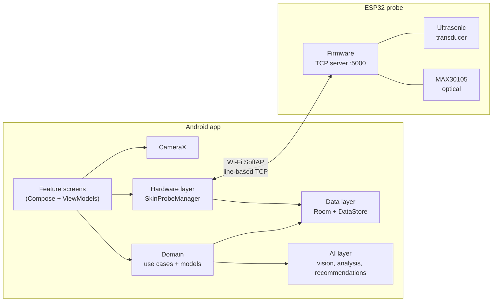
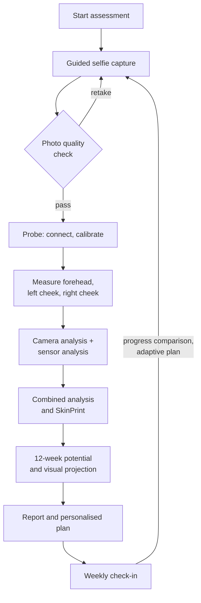

# Architecture

Skinthesia is a single-module Android app built with Kotlin and Jetpack Compose,
paired with ESP32 probe firmware. This document describes how the app is put
together and where each responsibility lives.

## System overview

## Layers

| Layer       | Package                 | Responsibility |
|-------------|-------------------------|----------------|
| Feature     | `feature/*`             | One package per product area. Each screen is a Compose function plus a `ViewModel` exposing `StateFlow` UI state. |
| Core        | `core/design`, `core/ui`, `core/navigation` | Design tokens (colour, type, spacing, motion), shared components and data-viz, brand assets, type-safe navigation graph. |
| Domain      | `domain/model`, `domain/repository`, `domain/usecase` | Pure Kotlin models, repository interfaces and the use cases that orchestrate an assessment end to end. No Android dependencies. |
| Data        | `data/local`, `data/repository`, `data/seed` | Room database (schema exported to `app/schemas`), DataStore-backed JSON preferences, local photo storage, seed catalogue and content. |
| AI          | `ai/*`                  | Photo-quality scoring, skin vision analysis, analysis engine, SkinPrint calculation, potential estimation, recommendations, adaptive plans, visual projection. |
| Hardware    | `hardware/probe`, `hardware/wifi`, `hardware/ble` | Probe state machine, transport seam, ESP32 Wi-Fi socket transport and the simulator. |
| Camera      | `camera`                | CameraX capture for guided selfies. |

## Dependency injection

`AppContainer.kt` is a hand-written dependency graph and the single place
where every implementation is chosen. Screens get it through the
`LocalAppContainer` composition local. Every mock or development
implementation sits behind a production interface, so replacing one, for
example a cloud vision model in place of `MockSkinVisionAnalyzer`, is a
one-line change in this file.

## Navigation

Routes are `@Serializable` Kotlin objects and classes in `Routes.kt` (57
destinations), wired in `SkinthesiaNavHost.kt`. Shared flows such as
capture, probe measurement and analysis carry a `FlowKind`
(`ONBOARDING`, `CHECK_IN`, `STANDALONE`), so the same screens serve
first-run onboarding, weekly check-ins and standalone use, and the navigator
decides where each one continues.

## Assessment pipeline

## Probe integration

`SkinProbeManager` is the app-wide probe state machine
(Idle, Scanning, Connecting, Connected, Calibrating, Ready, Failed). It is
built from two pluggable parts:

| Seam                 | Simulator                     | Real ESP32                   |
|----------------------|-------------------------------|------------------------------|
| `BleDeviceProvider` (discovery and connection) | `MockBleDeviceProvider` | `WifiSocketDeviceProvider` |
| `SensorDataProvider` (readings)               | `SimulatedSensorDataProvider` | `TcpSensorDataProvider` |

`USE_REAL_ESP32_PROBE` in `AppContainer.kt` selects the transport. In real
mode the manager is wrapped in `SwitchableSkinProbeManager`, so if the
physical probe cannot be found the user can choose **Simulate** and continue
the same flow on the simulator. Simulated readings are always labelled as such
in the UI. The wire format is in [PROBE_PROTOCOL.md](PROBE_PROTOCOL.md).

## Persistence and privacy

All data stays on the device. Assessments, measurements, plans, cart, orders,
bookings and community posts live in Room; the profile and settings live in
DataStore; photos are stored in app-private storage. `DataControlsUseCase`
backs the in-app "delete photos" and "delete everything" controls.

## Testing

| Suite                     | Location                    | Count |
|---------------------------|-----------------------------|-------|
| JVM unit tests            | `app/src/test`              | 57    |
| Instrumented Compose UI tests | `app/src/androidTest`   | 3     |

Unit tests cover the analysis engine, SkinPrint calculator, photo-quality
scoring, recommendation and adaptive-plan logic, potential ranges, commerce
models, routine scheduling and the probe simulation.
