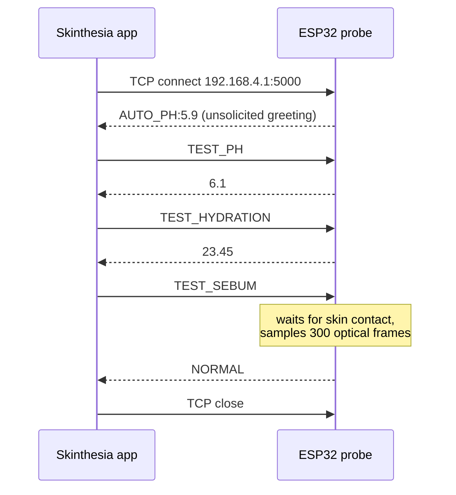

# Probe Communication Protocol

This document specifies how the Skinthesia Android app (and the bench tool in
[`tools/probe-cli`](../tools/probe-cli)) talk to the ESP32 skin probe running
[`firmware/esp32-probe/SRC_CODE/SRC_CODE.ino`](../firmware/esp32-probe/SRC_CODE/SRC_CODE.ino).

## Transport

| Property        | Value                                                  |
|-----------------|--------------------------------------------------------|
| Physical link   | Wi-Fi, probe runs its own access point (SoftAP)        |
| SSID            | `Detector_Device` (WPA2; passphrase set by `AP_PASSWORD` in the sketch) |
| Probe address   | `192.168.4.1` (ESP32 SoftAP default)                   |
| Port            | `5000`, plain TCP                                      |
| Encoding        | ASCII, one request or response per line                |
| Line endings    | Client sends `\n`; probe replies with `\r\n`           |
| Sessions        | One client served at a time; requests are sequential   |

The phone (or laptop) joins the probe's network, then opens a TCP socket. No
discovery, pairing handshake or TLS is involved.

## Session flow

Immediately after accepting a connection the probe pushes one
`AUTO_PH:<value>` line before any command is sent. Clients must read and
discard (or log) it so it is not mistaken for the reply to the first command.
The app does this with a 500 ms bounded read in `EspProbeSocket.open()`.

## Commands

Commands are case-insensitive and surrounding whitespace is ignored.

| Command          | Success reply                         | Failure replies       | Typical latency |
|------------------|---------------------------------------|-----------------------|-----------------|
| `TEST_PH`        | Decimal, one place, e.g. `6.1`        | n/a                   | < 50 ms         |
| `TEST_HYDRATION` | Echo distance in cm, e.g. `23.45`     | `HYDRATION_ERROR`     | < 50 ms         |
| `TEST_SEBUM`     | `DRY`, `NORMAL` or `OILY`             | `TIMEOUT`, `ERROR`    | 2 s to 25 s     |
| anything else    | n/a                                   | `INVALID_REQUEST`     | < 50 ms         |

### `TEST_PH`
Returns a pH value. **Current firmware status:** the value is generated in
the normal skin range (5.5 to 6.5) by `getRandomNormalPH()`; a pH electrode is
not yet sampled. The protocol and app pipeline are in place, so replacing the
function body with a real ADC reading needs no client change.

### `TEST_HYDRATION`
Fires the ultrasonic transducer (TRIG GPIO 32, ECHO GPIO 33) and returns the
echo distance in centimetres. `HYDRATION_ERROR` means no echo within 30 ms.
The value is passed through unconverted; mapping it to a calibrated hydration
index is a later calibration step.

### `TEST_SEBUM`
Optical sebum and oiliness classification with the MAX30105 sensor:

1. Waits up to 10 s for skin contact (IR reading at or above 5000 for 10
   consecutive samples). Reply `TIMEOUT` if no contact.
2. Averages 300 red, IR and green samples. Reply `ERROR` if the skin is
   lifted mid-measurement or sampling exceeds 15 s.
3. Computes the Red/IR and Green/IR reflectance ratios and returns the
   nearest of three calibrated profiles (`DRY`, `NORMAL`, `OILY`).

Clients should allow at least 30 s for this command.

## Client implementation in the app

| Concern                 | Location                                                        |
|-------------------------|-----------------------------------------------------------------|
| Socket, greeting drain, command/response | `app/.../hardware/wifi/WifiSocketDeviceProvider.kt` (`EspProbeSocket`) |
| Device discovery and connection lifecycle | `app/.../hardware/wifi/WifiSocketDeviceProvider.kt`      |
| Sensor reads and parsing | `app/.../hardware/probe/TcpSensorDataProvider.kt`              |
| Real-probe or simulator switch | `app/.../AppContainer.kt` (`USE_REAL_ESP32_PROBE`)       |

The app currently requests `TEST_PH` and `TEST_HYDRATION`. `TEST_SEBUM` returns
a category rather than a number, so it is not yet mapped into the app's numeric
sensor model; that integration is listed on the roadmap in the main README.

Unparseable replies, timeouts and dropped connections are never replaced with
substitute numbers. The reading is omitted, and if no sensor answers the
measurement is reported to the user as poor contact with a retry option.
